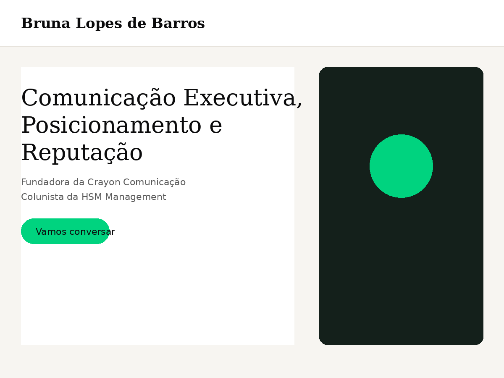

# Bruna Lopes de Barros — Tema WordPress Institucional

Tema WordPress customizado do zero (sem page builder) para site institucional de comunicação executiva — home one-page + blog, construído com foco em **performance (Core Web Vitals)**, **SEO técnico** e **indexação por buscadores e IAs**.

🔗 **Site no ar:** [brunalopesdebarros.com.br](https://brunalopesdebarros.com.br/) <!-- atualize se o domínio mudar -->



---

## Destaques técnicos

### Performance
- **Zero fontes externas** — pilha de fontes de sistema (sem requisição de rede, sem CLS por troca de fonte)
- Uma única folha de estilo e um único JS (`defer`, sem jQuery) no front-end
- Imagens em WebP, comprimidas, com `srcset` 1x/2x e `width`/`height` explícitos (evita layout shift)
- Preload da imagem LCP da home com `fetchpriority="high"`
- Limpeza de `<head>` (emoji scripts, RSD, WLW manifest, dashicons para visitantes, XML-RPC desativado, Heartbeat limitado ao editor)

### SEO e indexação por IAs
- Meta description, canonical, Open Graph e Twitter Card gerados dinamicamente, sem plugin
- **JSON-LD (schema.org)**: `Person`, `Organization`, `WebSite`, `Article`, `BreadcrumbList`
- `robots.txt` virtual liberando explicitamente rastreadores de IA (GPTBot, ClaudeBot, PerplexityBot, Google-Extended, CCBot)
- **`/llms.txt`** gerado dinamicamente (formato [llmstxt.org](https://llmstxt.org)) com resumo do site e posts recentes — pensado para orientar assistentes de IA sobre o conteúdo

### Funcionalidades
- Formulário de contato nativo via AJAX (honeypot + nonce, sem dependência de plugin)
- Blog com índice de conteúdo gerado automaticamente a partir dos H2/H3 do post
- Botões de compartilhamento (WhatsApp, LinkedIn, X, e-mail, copiar link) com SVGs inline — zero scripts de terceiros
- Card do autor e posts relacionados no final de cada artigo
- Menu mobile funcional (hambúrguer animado) e header sticky

---

## Stack

- PHP puro (tema clássico, sem dependência de framework ou page builder)
- CSS com custom properties (design tokens centralizados — paleta, tipografia, espaçamento)
- JavaScript vanilla (sem build step, sem bundler)

## Estrutura de arquivos

```
brunalopes/
├── style.css              → design tokens + todo o CSS do tema
├── functions.php
├── front-page.php         → home institucional (one-page)
├── home.php               → listagem do blog
├── single.php             → post individual (índice, compartilhamento, relacionados)
├── inc/
│   ├── setup.php          → theme supports, menus, tamanhos de imagem
│   ├── enqueue.php        → assets + preload da imagem LCP
│   ├── cleanup.php        → remoção de bloat do <head>
│   ├── seo.php            → meta tags, JSON-LD, robots.txt, /llms.txt
│   ├── contact-form.php   → formulário nativo via wp_mail() + AJAX
│   └── template-tags.php
├── template-parts/
└── assets/
    ├── js/main.js
    └── images/
```

## Instalação local (para avaliar o código)

```bash
# copie a pasta para wp-content/themes/ de uma instalação WordPress local
# ative em Aparência > Temas
# Configurações > Leitura: defina uma página estática como Início
#   e outra como Página de posts
```

Detalhes completos de instalação e configuração em [`readme.txt`](readme.txt).

---

*Versão de portfólio: fotos originais do cliente substituídas por imagens placeholder genéricas. Domínio e e-mail de contato também genéricos — o código de produção usa os dados reais do cliente.*
